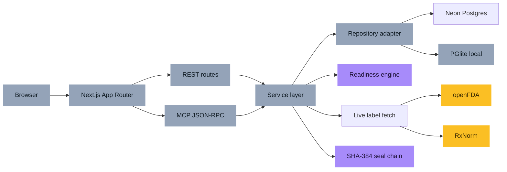
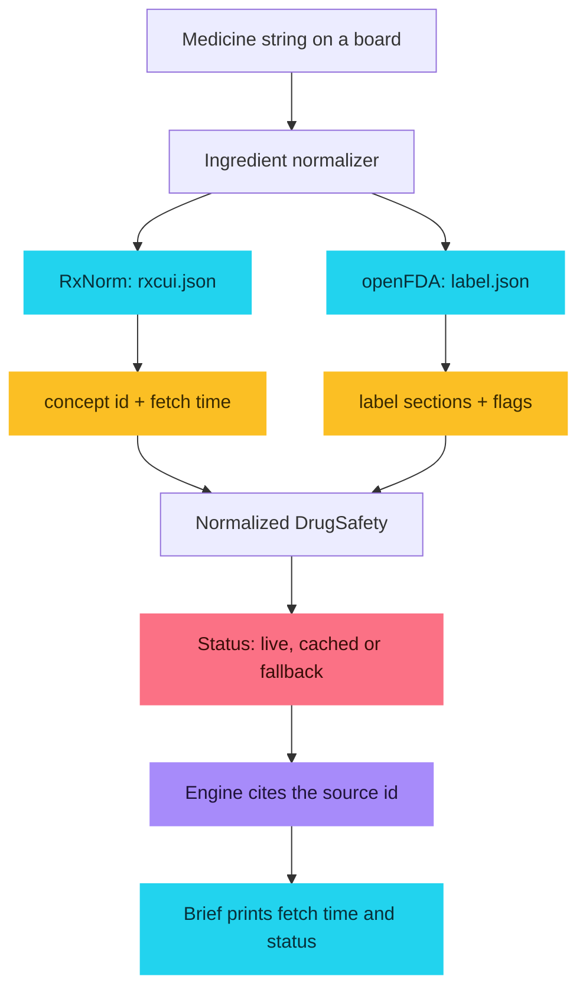
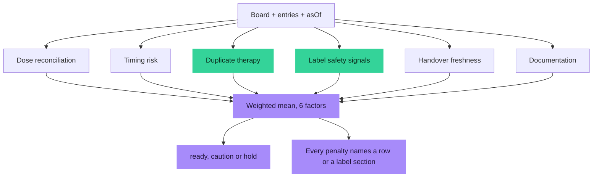
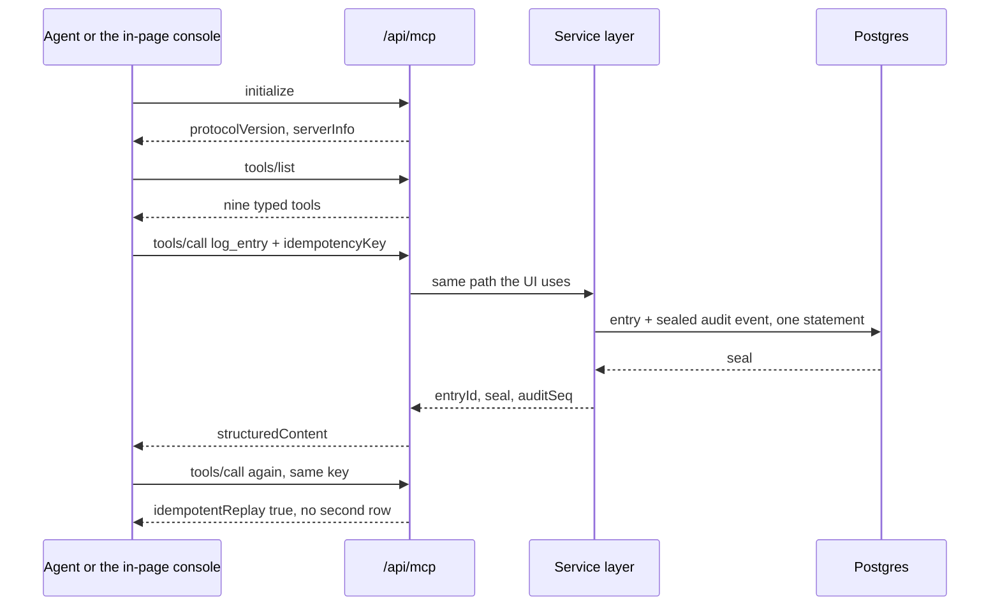
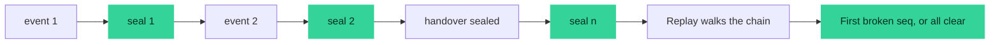
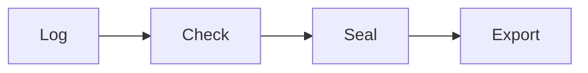
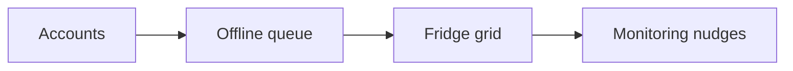
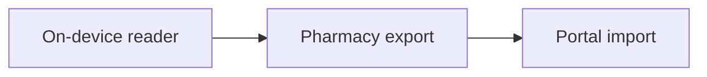

<div align="center">

# Handover

### The shift-change board for one person you love.

Log the dose. Let a deterministic engine tell you what the next caregiver is
about to get wrong. Seal a brief they can act on at 3am without asking you
anything.

[](https://handover.vercel.app)
[](https://nextjs.org)
[](https://www.typescriptlang.org)
[](./LICENSE)
[](https://open.fda.gov/apis/drug/label/)
[](https://modelcontextprotocol.io)

**[Live app](https://handover.vercel.app)**
· **[GitHub](https://github.com/aniruddhaadak80/handover)**
· **[API](#-api)**
· **[Agent](#-agent-console)**
· **[Issues](https://github.com/aniruddhaadak80/handover/issues)**

</div>

---

> **Not medical advice.** Handover surfaces record-keeping gaps and the presence
> of public label sections. It does not diagnose, and it never tells anyone to
> start, stop or change a dose. Anything it flags is a reason to ask the
> prescriber or the pharmacist. If someone is in danger, call emergency
> services.

---

## Why this exists

This started as a board for one specific person, for the friend who was the
only person coordinating a parent's medication after a hospital discharge.
Four people were helping. Each of them believed they knew the schedule.

The hard part was never the medication. It was that the shared picture lived in
five conversations and nobody could prove what had already been given. So this
is deliberately narrow: one board for one person, one deterministic check
before a shift changes hands, and one sealed brief that the next person can
actually act on alone.

It stays general enough that anyone can start a board tonight.

## ✨ Features

- **One board per person, no account.** Log doses, observations, physio notes
  and tasks. Each entry carries who owns it, so "somebody should do this" has
  nowhere to hide.
- **Catches two entries for one ingredient.** A brand name and a generic name
  for the same drug is the classic duplicate-therapy record. The engine
  normalizes both and quotes the two rows back at you.
- **Catches food-timing collisions.** A dose needing an empty stomach 30
  minutes before one needing food is a real, checkable mistake.
- **Reads public label sections.** NIH RxNorm resolves the concept id; openFDA
  supplies the label. Presence of a boxed warning or contraindications section
  is surfaced as "a pharmacist should read this with you", never as advice.
- **Refuses to call silence safe.** When no label could be retrieved, that
  factor is marked unscored rather than passing.
- **A deterministic, versioned, explainable engine.** Six weighted factors,
  every penalty traceable to a row or a label section. Weights are editable.
- **Seals every decision.** SHA-384 hash chain over every create, update,
  decision and handover. Replay it; if a row was rewritten, the first broken
  sequence number is reported.
- **The shift scrubber.** Drag the handover moment; entries physically move
  from the outgoing person to the next one and the engine re-runs for that
  exact instant.
- **A real downloadable artifact.** Markdown and printable HTML brief with the
  dose timeline, the open risks, the sources and the seal.
- **An agent interface.** Nine MCP JSON-RPC tools over the same service layer,
  with idempotent mutations.
- **Zero required keys.** No model key, no data key, nothing to sign up for.

## 🚀 Quickstart

```bash
git clone https://github.com/aniruddhaadak80/handover
cd handover
npm install
npm run dev
```

Open <http://localhost:3000> and press **Open the worked example**.

**Zero required environment variables.** The dev server boots an embedded
Postgres in `.data/`, applies the schema idempotently, and reads label data from
the public openFDA and RxNorm APIs with no key.

To rehearse the production bundle on a laptop:

```bash
npm run build
HANDOVER_ALLOW_EMBEDDED=1 npm start     # PowerShell: $env:HANDOVER_ALLOW_EMBEDDED="1"; npm start
```

To use a hosted database instead, set one variable and nothing else:

| Variable | Required in production | Purpose |
| --- | --- | --- |
| `DATABASE_URL` | yes | Hosted Postgres (Neon, Vercel Postgres, Supabase, any Postgres 14+) |
| `HANDOVER_ALLOW_EMBEDDED` | no | Local rehearsal only. Never set on a real deployment. |
| `PGLITE_DATA_DIR` | no | Where the embedded database writes locally |
| `NEXT_PUBLIC_SITE_URL` | no | Canonical origin for metadata and the agent manifest |

Production without `DATABASE_URL` **fails loudly** rather than silently using an
embedded database that the next redeploy would erase.

### Quality commands

```bash
npm run typecheck   # tsc --noEmit
npm run lint        # eslint .
npm run test        # 61 tests: engine, seal chain, extractor, real store
npm run build       # production build
npm run test:e2e    # Playwright journey, desktop + mobile
npm run verify:live # end-to-end proof against a running deployment
```

## 📁 Project map

| Route | What it is for | Writes |
| --- | --- | --- |
| `/` | The pitch and the two real actions that create a board | board + example entries |
| `/boards` | Ward desk: every board with a live score | board creation |
| `/boards/[id]` | The board itself: filters in the URL, decide, delete | entries, decisions, tombstones |
| `/boards/[id]/regimen` | Medicines on this board against public label text | nothing; live lookups only |
| `/handover` | **The signature screen.** Scrub the handover moment, seal it, download the brief | handover seal |
| `/agent` | Live MCP console with one-click `tools/call` | agent-logged entries |
| `/verify` | Replay the seal chain and read the event log | nothing |
| `/settings` | Engine weights, window size, your name on this device | session settings |
| `/share/[token]` | Read-only share route for one board | nothing |

| API | Methods | Notes |
| --- | --- | --- |
| `/api/health` | GET | Real write + read-back against the production store |
| `/api/boards` | GET, POST, PATCH | List, create, rename |
| `/api/boards/[id]` | GET, PATCH, DELETE, POST | Read, update, soft-delete (needs `confirm`), mint a share link |
| `/api/boards/[id]/entries` | GET, POST | List and log entries |
| `/api/entries/[id]` | PATCH, DELETE | Decide; soft-delete (needs `confirm`) |
| `/api/boards/[id]/handover` | GET, POST | Analysis and brief; POST seals a handover |
| `/api/boards/[id]/integrity` | GET | Replay the chain, optionally with the log |
| `/api/drugs/[name]` | GET | RxNorm + openFDA, honestly labelled live/cached/fallback |
| `/api/import/note` | POST | Deterministic discharge-note extraction |
| `/api/export/[boardId]` | GET | Markdown or printable HTML brief |
| `/api/settings` | GET, PATCH | Weights, window, caregiver name |
| `/api/mcp` | POST | JSON-RPC 2.0: `initialize`, `tools/list`, `tools/call` |
| `/mcp.json` | GET | Agent manifest with the real deployed endpoint |

## 🏗 Architecture



The repository adapter is the only thing that changes between local and
production. Same schema, same queries, same domain logic.

## 📡 Data provenance and the honest fallback



- Two independent public sources, both keyless, both attributed with a fetch
  time and an upstream id.
- Requests are time-boxed, retried twice, then served from a stale cache.
- When both sources fail, the response is explicitly `fallback`: **no label
  text is invented**, and the label factor is scored as unscored rather than
  safe.
- When openFDA returns a combination product for your ingredient, the UI says
  so instead of pretending the match was exact.
- Fallback never replaces user-created data. It only ever fills in what is
  missing.

## 🧮 The readiness engine



`score = Σ(weight × value) / Σ(weight)`, each factor scored 0-100.

| Factor | Default weight | What it penalises |
| --- | --- | --- |
| Dose reconciliation | 0.24 | Doses past due and still marked `due`; doses logged over 4 hours late; `given` with no timestamp |
| Timing risk | 0.16 | Two doses in the same minute; food and empty-stomach instructions within an hour; long gaps for the same medicine |
| Duplicate therapy | 0.22 | Two entries whose ingredient tokens resolve to one active substance |
| Label safety signals | 0.16 | Boxed warning, contraindications, interaction sections present; no label retrieved at all |
| Handover freshness | 0.14 | Nothing recorded for 6, 12 or 24 hours; entries with no named owner |
| Documentation | 0.10 | A dose with no amount written down; a note too thin to act on |

`ready` when nothing is below 85 and no factor is under 85; `hold` when any
factor is under 55, or the board is empty. The engine takes `asOf` as a
parameter, never calls the clock, and sorts every input, so the same board at
the same moment always produces byte-identical output. 48 unit tests cover
normal, boundary, empty, malformed and repeat cases.

## 🤖 Agent console



Tools: `list_boards`, `get_board`, `analyze_handover`, `lookup_drug`,
`extract_care_rows`, `verify_integrity`, `log_entry`, `update_entry_status`,
`seal_handover`.

Point any MCP client at the deployed endpoint:

```bash
curl -s https://handover.vercel.app/mcp.json
```

```json
{
  "mcpServers": {
    "handover": {
      "type": "http",
      "url": "https://handover.vercel.app/api/mcp"
    }
  }
}
```

Scope is the calling browser's session cookie, so an agent can only ever touch
the boards that session owns.

## 🔏 Integrity and seal replay



```
seal_n = SHA-384( UTF-8(prevSeal) || canonicalJson(event_n) )
canonicalJson = keys sorted recursively, array order preserved
genesis prevSeal = "0" repeated 96 times
```

`scripts/print-vectors.ts` (removed before release, reproduced by the pinned
vectors in `tests/seal.test.ts`) generated the known-answer vectors that the
suite asserts, so a refactor cannot quietly rewrite history. Deletes keep a
tombstone so the chain still replays end to end after a board is soft-deleted.

## 🔌 API

```bash
BASE=https://handover.vercel.app

# Health: proves the store answers a real write and read-back
curl -s $BASE/api/health

# Create a board
BOARD=$(curl -s -X POST $BASE/api/boards \
  -H 'content-type: application/json' \
  -c jar.txt -b jar.txt \
  -d '{"subjectName":"My dad","timezone":"UTC","caregivers":["Priya","Ravi"],"withExampleEntries":true}' \
  | sed -n 's/.*"id":"\([^"]*\)".*/\1/p' | head -1)

# Log a dose, and read it back
curl -s -X POST $BASE/api/boards/$BOARD/entries \
  -H 'content-type: application/json' -b jar.txt -c jar.txt \
  -d '{"kind":"dose","status":"due","title":"Metformin 500 mg","detail":"With breakfast.","medication":"Metformin 500 mg","doseAmount":"1 tablet","instructions":"with food","assignedTo":"Priya"}'

curl -s $BASE/api/boards/$BOARD -b jar.txt | head -c 400

# Decide on it
ENTRY=$(curl -s $BASE/api/boards/$BOARD/entries -b jar.txt | sed -n 's/.*"id":"\(ent_[^"]*\)".*/\1/p' | head -1)
curl -s -X PATCH $BASE/api/entries/$ENTRY \
  -H 'content-type: application/json' -b jar.txt \
  -d "{\"boardId\":\"$BOARD\",\"status\":\"given\"}"

# Run the engine
curl -s "$BASE/api/boards/$BOARD/handover" -b jar.txt | head -c 600

# Replay the chain
curl -s "$BASE/api/boards/$BOARD/integrity" -b jar.txt

# Agent, over JSON-RPC
curl -s -X POST $BASE/api/mcp -H 'content-type: application/json' -b jar.txt \
  -d '{"jsonrpc":"2.0","id":1,"method":"tools/call","params":{"name":"analyze_handover","arguments":{"boardId":"'"$BOARD"'"}}}'

# Export the brief
curl -s "$BASE/api/export/$BOARD?format=markdown" -o handover.md
```

### Errors

Every failure is the same shape, and never leaks a stack trace, SQL or an
environment value:

```json
{ "error": { "code": "validation_failed", "message": "The request body did not pass validation." } }
```

`400` malformed JSON · `404` not yours or not there · `405`/unsupported media ·
`409` a write landed first or the board is deleted · `413` body over 64 kB ·
`422` validation · `428` destructive action without `confirm` · `503` store
unavailable.

## 🔒 Security and ownership

- **No accounts.** A 128-bit session id in an HTTP-only, `SameSite=Lax` cookie,
  minted in Edge middleware before any handler runs. Every query is scoped by
  `owner_id`, so one session can never read another's board.
- **Parameterised SQL only.** Each domain row and its audit event are written in
  a single statement, so a row can never exist without its sealed event.
- **Validated input.** Zod schemas with length and enum bounds on every mutating
  body; 64 kB cap; allowlisted external origins; time-boxed upstream calls.
- **Destructive actions are guarded and reversible-looking.** Board and entry
  deletion require an explicit `confirm` echo and are soft, leaving a tombstone.
- **Best-effort abuse controls, stated honestly.** Per-session cookie ownership,
  body caps and validation are enforced. Anonymous write *rate limiting* is not
  enforced in-process, because a serverless instance is ephemeral and a
  per-process counter is not a real limit. Put a hosted limiter in front of
  `/api/boards` and `/api/mcp` if you expose this at scale.
- **One production secret.** `DATABASE_URL`. Nothing else, anywhere.

Full detail in [SECURITY.md](./SECURITY.md).

## 🗺️ Roadmap

**Now — shipped and verified**

- [x] Boards, entries, ownership, soft deletes
- [x] Six-factor deterministic engine with itemized evidence
- [x] Live openFDA + RxNorm with honest fallback labelling
- [x] SHA-384 seal chain with replay and pinned vectors
- [x] Shift scrubber, sealed handover, downloadable brief
- [x] Nine MCP tools with idempotent mutations



**Next — the gaps I know about**

- [ ] Accounts with household roles, so a board survives a cleared cookie and
      two siblings can both edit without stepping on each other
- [ ] An offline-first queue: write entries on a dead connection and reconcile
      them when it comes back, because ward wifi is terrible
- [ ] A printable weekly grid for the fridge door, which is where this actually
      needs to live
- [ ] Monitoring-term coverage: when a label asks for a test, nudge for the
      result rather than only reporting the term exists
- [ ] Hosted rate limiting in front of the anonymous write endpoints



**Later — only if someone asks**

- [ ] An on-device open-weights reader for pasted discharge summaries, so a
      parent's paperwork never has to travel to a server we control
- [ ] A pharmacy handoff export in a format pharmacists already read
- [ ] Import from a hospital discharge portal



Nothing on this list is promised, dated, or partially shipped.

## 🤝 Contributing

Small, focused PRs. The one rule: **do not make the engine guess** — if you
change a factor, you must be able to say what evidence caused each penalty.
Read [CONTRIBUTING.md](./CONTRIBUTING.md), then run `npm run typecheck`, `npm run
lint`, `npm run test` and `npm run build`.

## 📄 Attribution

- Label data: [openFDA drug label API](https://open.fda.gov/apis/drug/label/) (public domain, U.S. FDA)
- Concept ids: [NIH RxNorm](https://lhncbc.nlm.nih.gov/RxNav/APIs/RxNormAPIs.html) (U.S. National Library of Medicine)
- Embedded database for local development and tests: [PGlite](https://pglite.dev) (Postgres compiled to WASM)
- Agent protocol: [Model Context Protocol](https://modelcontextprotocol.io)

## License

[MIT](./LICENSE). Take it, fork it, build the version your own family needs.