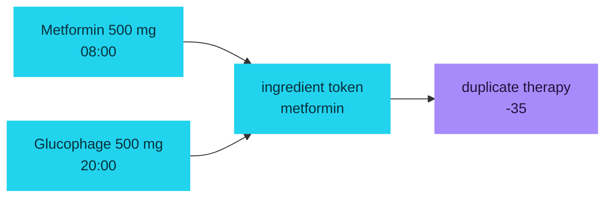
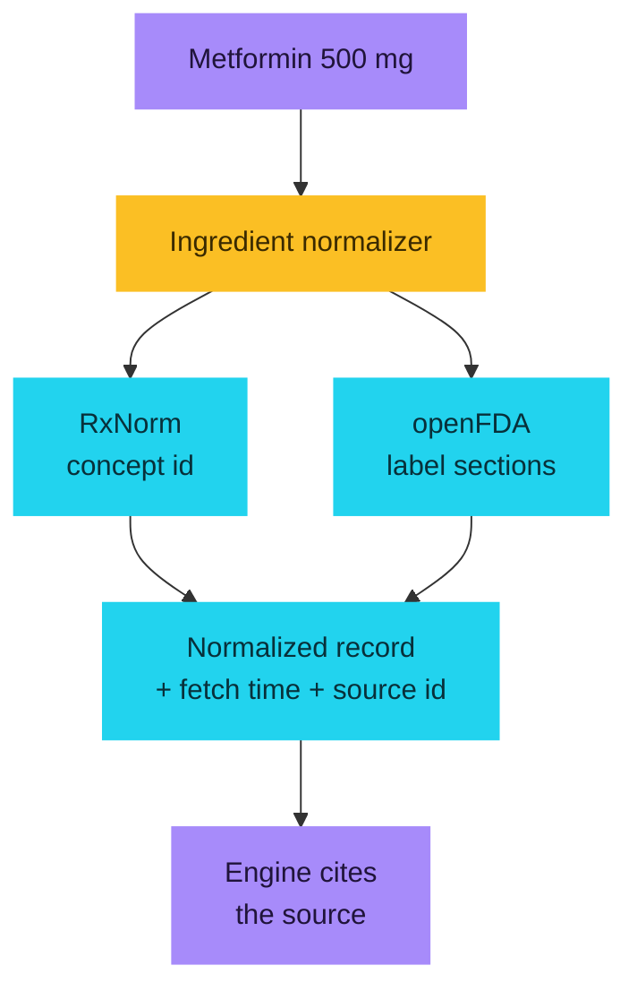

# I built a handover board for the friend who was doing all the remembering

**This is a DEV Hacktoberfest Weekend Challenge submission: _Build for a Friend_.**

**[Live app](https://handover-olive.vercel.app)** · **[GitHub](https://github.com/aniruddhaadak80/handover)** · **[Agent tools](https://handover-olive.vercel.app/mcp.json)**

When my friend came home from hospital, the hard part was never the medication.
It was that four people were helping, each of them believed they knew the
schedule, and nobody could prove what had already been given. She was doing all
of it from memory, at 3am, with a phone full of half-finished messages.

So I built her one board instead of a family group chat.


## What it does

You open a board for one person. You log doses, blood pressures, the note the
physio left, the blood test someone needs to book. Each entry carries **who owns
it**, so "somebody should do this" has nowhere to hide.

Then, before the care changes hands, you drag a **handover moment** along a
shift rail. Every entry physically moves from the outgoing person to the next
one, and a deterministic engine re-runs for that exact instant. It tells you,
in itemized form, what the next person is about to get wrong.

Then you seal it. And you download a brief they can act on alone.

## The two things it actually catches

**Two entries, one ingredient.** The worked example I ship has "Metformin 500
mg" at breakfast and "Glucophage 500 mg" in the evening. Glucophage *is*
metformin. A brand name and a generic name for the same drug, on the same board,
at two different times. That is the single most common medication record-keeping
error there is, and it is trivially invisible to a human reading a list.



**A food-timing collision.** Levothyroxine needs an empty stomach. Metformin
needs food. Scheduled 30 minutes apart. Nobody catches that at 7am.

## Why the open pieces are what makes it work

This is the part the challenge actually asks about, so I want to be precise
rather than clever.

**There is no model in the scoring loop, and that is a feature.** The readiness
score is a weighted mean of six factors, each penalty traceable to a specific
row on the board or a specific section of a public label. The engine takes the
reference moment as a parameter, never calls the clock, and sorts its inputs,
so the same board at the same moment produces byte-identical output. 48 unit
tests pin that, including a byte-equality test across shuffled input.

For a family making a decision at 3am, "the model said so" is worth nothing. A
number you can read back to a row is worth something. That is a place where
open, inspectable code beat a closed service for me.

**The discharge-note parser is deterministic too.** Paste a discharge summary
and you get reviewable draft rows with a confidence and the source line quoted
back. It is regular expressions and a small grammar, and that is exactly
enough. A draft regimen that a stranger cannot reproduce is a draft nobody
should trust with a parent's medication.

**Live data comes from two keyless public APIs.** NIH RxNorm resolves the
concept id. openFDA supplies the label sections. Both are free, public,
unauthenticated infrastructure.



And the failure mode is the part I care about most: **when both sources fail,
nothing is invented.** The response says `fallback`, no label text is
fabricated, and the label factor is scored as *unscored* rather than passing.
Silence is not safety. When openFDA returns a combination product for your
ingredient, the UI says so instead of pretending the match was exact.

## The hash chain, because "I already gave it" is a claim about the past

Every create, update, decision and sealed handover appends one row:

```
seal_n = SHA-384( UTF-8(prevSeal) || canonicalJson(event_n) )
```

Canonical JSON sorts keys recursively and preserves array order. Deletes leave a
tombstone so the chain still replays after a board is soft-deleted. Replay
reports the first broken sequence number, and the suite asserts pinned
known-answer vectors so a refactor cannot quietly rewrite what already happened.

This started as me not trusting my own memory about a dose. It turned into the
thing I am proudest of in the project.

## Agents get the same door

Nine MCP tools over JSON-RPC 2.0, scoped to the calling session, with
idempotent mutations so a retry cannot double-log a dose.

```json
{
  "mcpServers": {
    "handover": { "type": "http", "url": "https://handover-olive.vercel.app/api/mcp" }
  }
}
```

The mutating tools go through the same service layer as the browser buttons, so
an agent cannot do anything the UI could not.

## Data location was the real design question

This is health-adjacent data about a specific person, and I did not want it
sitting in a database I could casually read. So ownership is an anonymous
128-bit session in an HTTP-only cookie, minted in Edge middleware before any
handler runs, and every query is scoped by it. No accounts, no email, no
profile, nothing to phish.

The tradeoff is real and I put it in the README: clearing your cookie loses
access to the board. I would rather ship that tradeoff honestly than pretend a
sign-up flow makes the privacy better. It is first on the roadmap to fix, with
household roles.

## What it costs to run

One environment variable. `DATABASE_URL`.

```bash
git clone https://github.com/aniruddhaadak80/handover
cd handover
npm install
npm run dev
```

Embedded Postgres locally, Neon in production, no keys, no model, no account.

## Where open beat closed, concretely

| Decision | Why the open path won |
| --- | --- |
| Deterministic engine instead of an LLM | A score you can read back to a row is auditable; a score a model produced is not. |
| Public regulatory APIs instead of a scraped mirror | No key, no rate-limit fight, no data staleness I have to maintain. |
| Postgres and an explicit schema instead of a document store | I needed a unique constraint on `(board_id, seq)` to make the chain tamper-evident. That needed a real relational constraint. |
| SHA-384 in Node instead of a hosted signing service | The chain has to be verifiable by anyone who clones the repo, with no account and no bill. |

## Honest limitations

- It is not a medical device and never tells anyone to change a dose.
- Anonymous ownership means a cleared cookie loses the board.
- Anonymous write rate limiting is not enforced in-process, because a serverless
  instance is ephemeral and a per-process counter is not a real limit. A hosted
  limiter goes in front of the write endpoints at scale. This is documented, not
  glossed over.
- openFDA label matching is first-match, so ingredient-level matching is a
  known rough edge I chose to surface rather than hide.

## Verification

`npm run typecheck`, `npm run lint`, 61 unit and integration tests, the
production build, a Playwright journey on desktop and mobile with zero console
errors, and a checked-in `scripts/verify-live.mjs` that proves the whole loop
against a live deployment: **60 of 60 checks passed against production**, from
board creation through an MCP mutation to seal replay and confirmed deletion.

---

If you are the person in this story, the point was never the software. It was
being able to go to sleep.

**Repo:** https://github.com/aniruddhaadak80/handover
**Live:** https://handover-olive.vercel.app

`#devchallenge` `#weekendchallenge` `#hf26challenge`